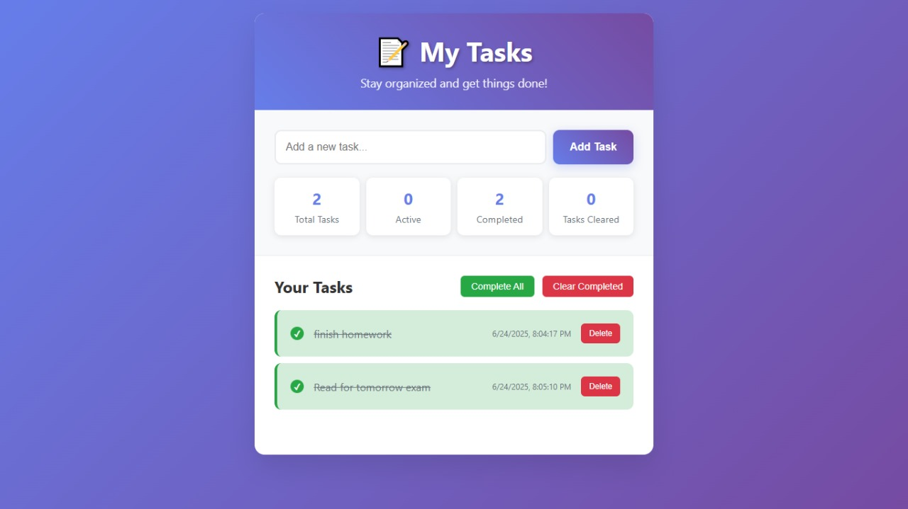
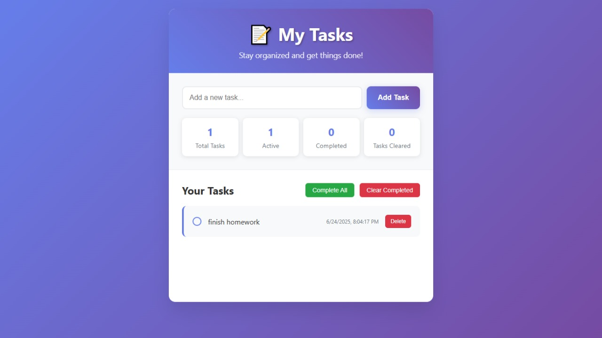
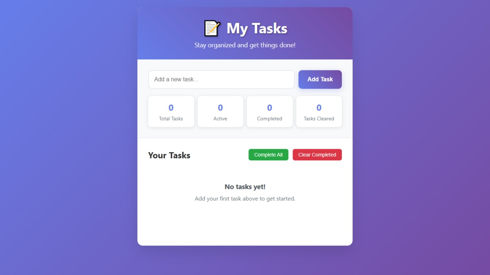

# To-Do List Application

## Project Overview

A simple, elegant, and responsive To-Do List Web App built using HTML, CSS, and JavaScript. This app allows you to manage tasks efficiently with a clean and modern UI.

---

## Features

- ✅ **Add Tasks** – Quickly add new tasks using input and button or the Enter key.
- ✅ **Mark as Complete** – Toggle tasks between active and completed states.
- ✅ **Delete Tasks** – Remove unwanted tasks easily.
- ✅ **Complete All** – Mark all active tasks as completed in one click.
- ✅ **Clear Completed** – Remove all completed tasks with a single click.
- ✅ **Task Statistics** – View real-time stats: Total, Active, Completed, and Cleared tasks.
- ✅ **Responsive Design** – Works smoothly on desktops, tablets, and mobile devices.
- ✅ **Animated Notifications** – Success and error alerts with smooth animations.
- ✅ **Auto Timestamp** – Each task includes a timestamp for better tracking.
- ✅ **Smooth UI Interactions** – Hover effects, animations, and counters.

---

## Technologies Used

- HTML5 – Structure of the app.
- CSS3 – Styling with gradients, animations, and responsive design.
- JavaScript (ES6) – App logic and dynamic task management.

---

## Project Code

The full source code is available in [`index.html`](index.html)

---

## Screenshots

### Output 1

### Output 2

### Ouput 3

---

## Future Improvements

- 🗂 Local Storage to persist tasks even after refreshing the page.
- 🎨 Dark Mode for better accessibility.
- 🔍 Search & Filter options to easily manage large task lists.
- 📱 Progressive Web App (PWA) support for offline usage.
---

## 👨‍💻 Developed By

**Ragul T**  
---

## 📝 License

This project is open-sourced under the MIT License. See the [LICENCE](LICENCE) file for details.

